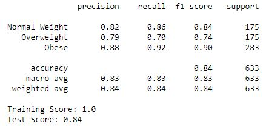
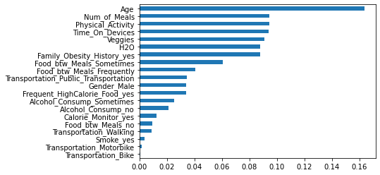

# Phase 3 Project

## Overview

The goal of the project was to create appropriate models using categorical data of multiple person's eating habits, lifestyle habits, and other factors to offer an insight as to what factors contribute most to a person's weight/obesity level.

## Business Problem

During the pandemic, people's livelihood and lifestyles have changed to a more sedantary one. Even before the pandemic had started, obesity has continuously proven to be a major health concern in the U.S. Because of this the South Bend Clinic as well as the St. Joseph's Department of Health are looking into the relationship between people's lifestyles, eating habits, as well as other factors such as family's history of obesity to offer its residents
(something about tips on weight loss or how to prevent obesity or to be able to tell the residents/patients on if they will become more likely to be obese or overweight if they keep this lifestyle up/ given their current lifestyle and their family history and such)

## Data Cleaning / Data Preparation

Before doing the train test split, I made sure that there were no missing values. After doing the train test split, I one hot encoded the categorical variables. I noticed that there were too many columns considering the number of categorical variables and their possible options.

As can be seen, categorical variables: Veggies, Num_of_Meals, H2O, Physical_Activity, and Time_On_Devices had more than 1,000 possible options per variable. Below is a bar graph that shows each weight categories' weekly vegetable consumption. 1 being not consuming any or barely consuming vegetables; 2 is consuming vegetables occasionally during meals; 3 is consuming vegetables at least once in their daily diet. Even though it is a categorical variable, it almost seems to be a numerical variable.  

Because of the said categorical variables resembled numerical variables, I decided to round the values to its nearest whole integer. 

  
After discussing the project with my instructor, we decided to create another data frame that was the exact copy of the original data frame before the rounding process. Also, we decided to consider the categorical variables resembling numerical variables to be numerical because these variables were SMOTE'd. Another aspect that we changed was the number of weight classes in the dependent variable. Originally, individuals were divided into insufficient; normal; overweight levels 1 and 2; and obesity type 1,2, and 3. The large number of possible outcomes reduced the models' accuracy and made it difficult to compare how much the variables affected between the different weight categories. 
 

## Data Modeling

For the modeling process, I chose random forest, K nearest neighbors, and logistic regression because of two reasons: many of the independent variables were multi-categorical and there were high number of possible outcomes for the dependent variable. All of the models will have at least two variants as the original data was SMOTE'd and many categorical variables became numerical variables. The first version of the model will be using the SMOTE'd version where I rounded the categorical variables' values to the nearest whole number to continue to treat them as categorical variables, and the second version of the models will be un-SMOTE'd where I do not round those values and treat them as numerical data.

### Random Forrest
For the random forest, I first created a function that outputted the model's training score, test score, and the confusion matrix when given the type of model and the training and test data for both x and y. 

After I fitted the model with the training data for x and y, I used the above function to output the scores and the confusion matrix.

With the feature_importances_ attribute of the model, I created a bar graph that showed how much effect each variable had.

The next two visuals are the un-SMOTE'd version of the data. Notice that the overall recall score has increased for the three categories. The bar graph showing each variables' importance also has some major changes, but we can see that Age is still the most important variable.

#### Grid Search CV
To find the best parameters for the random forest, a grid search was performed. Each type of the models had similar or same parameters for max depth, minimum samples leaf, and minimum samples split. The biggest difference for the grid search was that the model using the SMOTE'd data had 'gini' as its best criterion, and the model using un-SMOTE'd data had 'entropy' as its best criterion.

The next images show the confusion matrices and the variable importance bar graph for each variant of the data. The first images show the changes to the confusion matrix and bar graph after the grid search had been performed, and the latter is the un-SMOTE'd version. Compared to the improvements seen in the SMOTE'd data, there isn't much improvement for the un-SMOTE'd data. 

 

### K-Nearest-Neighbors

### Logistic Regression

## Results

## Conclusion